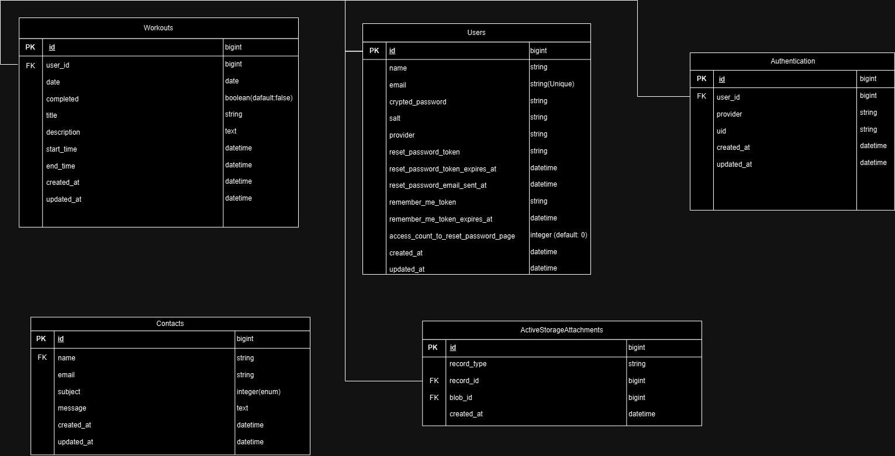

# プロジェクト名：『筋肉は全てを解決する』

# サービス概要
～筋トレは自分のために。AIを活用した筋トレサポート～

『筋肉は全てを解決する』は、AIにメニューを考えてもらい、それをユーザーが行ったか行っていないかで、面白い動画、やる気が出る動画を表示することが出来るサービスです。
筋トレを継続することで、少しでも筋トレに興味を持ってもらったり、自分の体に変化を感じてもらい、モチベーションの継続に活かすことが出来るサービスとなっています。

# サービスURL
### [https://new-project-1-vkar.onrender.com](https://new-project-1-vkar.onrender.com)

# サービス開発の背景
高校生の頃に、私が筋トレが好きな友人から飽きるほど聞かされた言葉です。
実際自分は自分に自信が無く、人としゃべる際に「嫌われたら」「不快な思いをさせてしまったら」「周りから仲間はずれにされたら」というように悩んでいました。
しかし筋トレを行うことで、自分の体が変化していき、ネガティブな考えが少なくなっていき、自分に自信を持てるようになりました。

筋トレを含む運動は、エンドルフィン、セロトニン、ドーパミン、オキシトシンといった「幸せホルモン」の分泌を促進し、心身の健康や幸福感の向上に寄与します。
これにより、ストレスの軽減、気分の向上、睡眠の質の改善、社交性の向上などの多くのメリットが得られます。

自分は筋トレをしていることにより、メリットしか感じなかったので、このサイトを使って頂き、自分の周りに少しでも筋トレに興味を持ってもらうことが出来たらいいなと思っています。

# 機能紹介

| ユーザー登録 / ログイン |
|:---:|
|  | 
|『名前』『メールアドレス』『パスワード』『確認用パスワード』を入力してユーザー登録を行います。ユーザー登録後は、自動的にログイン処理が行われるようになっており、そのまま直ぐにサービスを利用する事が出来ます。 また、Googleアカウントを用いてGoogleログインを行う事も可能です。 |

| AIにメニューを組んでもらう |
|:---:|
|  |
| 6つのメニューを選択すると、AIによりメニューが自動で組まれます。 間違えて押し間違えてしまっても、1日に5回までメニューを組むことが出来ます。 |

| カレンダーに組んだメニューが反映される |
|:---:|
|  |
| AIにより作成されたメニューがカレンダーに追加されます。 間違えて作成した時は、削除することも可能です。 |
 
| 筋トレを行ったか行っていないかのフィードバック |
|:---:|
|  |
| ユーザーが行ったか行っていないかで、表示する動画を変えて、ユーザーのやる気を引き出すものを表示しています。 |

| 筋トレを行った報告がカレンダーに反映される |
|:---:|
|  |
| 筋トレを行った場合は、カレンダーに結果が反映されて、自分がどれだけ筋トレを行っているかが分かります。 |

# 技術構成について

| カテゴリ | 技術内容 |
| --- | --- | 
| サーバーサイド | Ruby on Rails 7.0.6・Ruby 3.2.2 |
| フロントエンド | Ruby on Rails（ERB テンプレート）・JavaScript（ES6） |
| CSSフレームワーク | Tailwind CSS |
| Web API | OpenAI API（GPT-3.5-turbo）・Google API（Google認証）・LINE Developers（LINEログイン） |
| データベースサーバー | PostgreSQL |
| キャッシュサーバー | Redis（ワークアウトメニュー生成） |
| ファイルサーバー | AWS S3（Active Storage） |
| 認証 | Sorcery（ユーザー認証） |
| アプリケーションサーバー | Render |
| バージョン管理ツール | GitHub・Git Flow |
| 開発環境 | VS Code・mkcert（ローカルSSL） |
| その他 | FullCalendar（カレンダー機能）・ransack（検索機能）・enum_help（enum翻訳） |

## ER図

## 画面遷移図
https://www.figma.com/design/4C25UVsbUpLTE7zcv9w6nP/%E6%9C%AC%E3%83%AA%E3%83%AA%E3%83%BC%E3%82%B9?node-id=0-1&m=dev&t=0VSVclDlOOdioWNj-1
